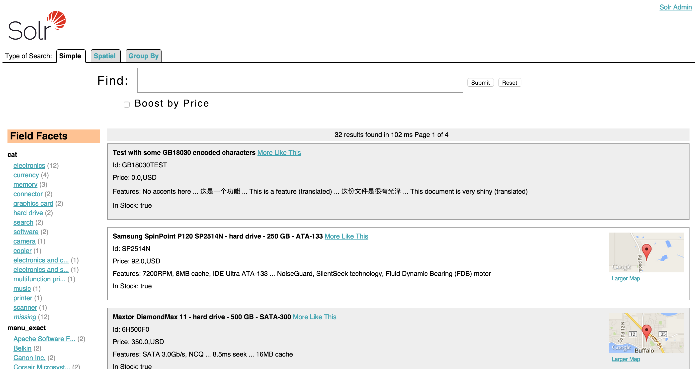

1.  link:index.html[Apache Solr Reference Guide]
2.  link:Apache-Solr-Reference-Guide.html[Apache Solr Reference Guide]
3.  link:Searching.html[Searching]

Velocity Search UI
------------------

Solr includes a sample search UI based on the link:Response-Writers.html#ResponseWriters-VelocityResponseWriter[VelocityResponseWriter] (also known as Solritas) that demonstrates several useful features, such as searching, faceting, highlighting, autocomplete, and geospatial searching.

When using the `sample_techproducts_configs` config set, you can access the Velocity sample Search UI here: `http://localhost:8983/solr/techproducts/browse`

 _The Velocity Search UI_

For more information about the Velocity Response Writer, see the link:Response-Writers.html#ResponseWriters-VelocityResponseWriter[Response Writer page].
