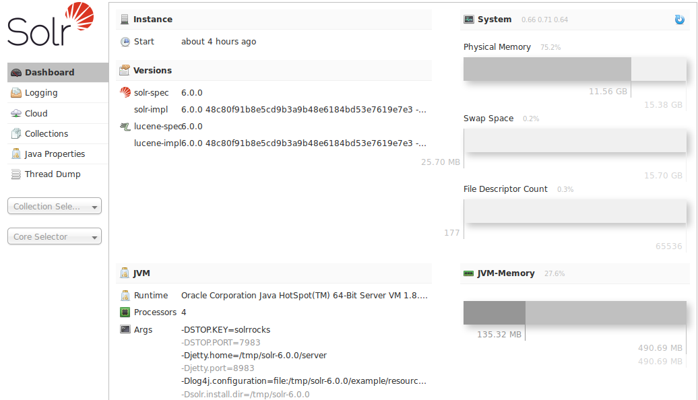

Overview of the Solr Admin UI
=============================
:page-shortname: overview-of-the-solr-admin-ui
:page-permalink: overview-of-the-solr-admin-ui.html

Solr features a Web interface that makes it easy for Solr administrators and programmers to view <<files-screen.adoc#,Solr configuration>> details, run <<query-screen.adoc#,queries and analyze>> document fields in order to fine-tune a Solr configuration and access <<getting-assistance.adoc#,online documentation>> and other help.

Accessing the URL `http://hostname:8983/solr/` will show the main dashboard, which is divided into two parts.

A left-side of the screen is a menu under the Solr logo that provides the navigation through the screens of the UI. The first set of links are for system-level information and configuration and provide access to <<logging.adoc#,Logging>>,<<collections-core-admin.adoc#,Collection/Core Administration>> and <<java-properties.adoc#,Java Properties>>, among other things. At the end of this information is at least one pulldown listing Solr cores configured for this instance. On <<solrcloud.adoc#,SolrCloud>> nodes, an additional pulldown list shows all collections in this cluster. Clicking on a collection or core name shows secondary menus of information for the specified collection or core, such as a <<schema-browser-screen.adoc#,Schema Browser>>, <<files-screen.adoc#,Config Files>>, <<plugins-stats-screen.adoc#,Plugins & Statistics>>, and an ability to perform <<query-screen.adoc#,Queries>> on indexed data.

The center of the screen shows the detail of the option selected. This may include a sub-navigation for the option or text or graphical representation of the requested data. See the sections in this guide for each screen for more details.

Under the covers, the Solr Admin UI re-uses the same HTTP APIs available to all clients to access Solr-related data to drive an external interface.

Note:

The path to the Solr Admin UI given above is `http://hostname:port/solr`, which redirects to `http://hostname:port/solr/#/` in the current version. A convenience redirect is also supported, so simply accessing the Admin UI at `http://hostname:port/` will also redirect to `http://hostname:port/solr/#/`.

[[OverviewoftheSolrAdminUI-RelatedTopics]]
== Related Topics

* <<configuring-solrconfig-xml.adoc#,Configuring solrconfig.xml>>
