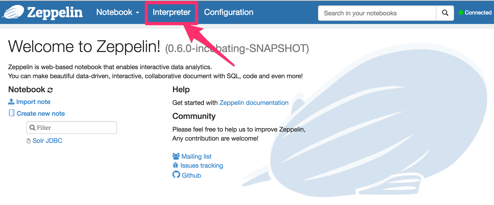
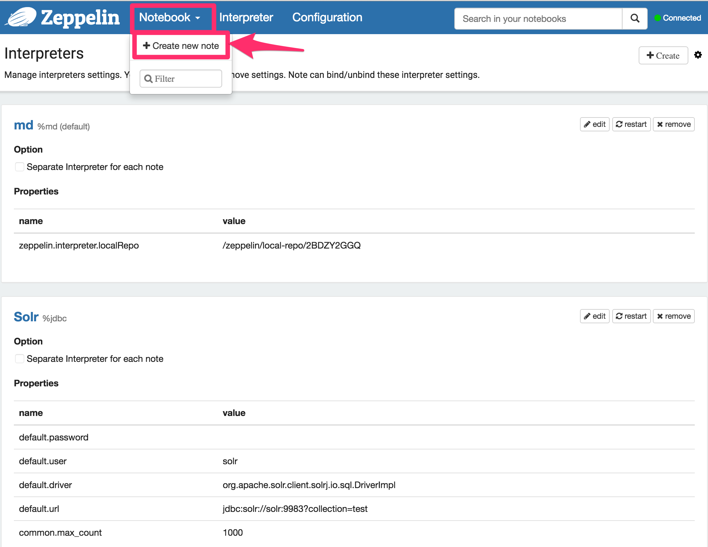
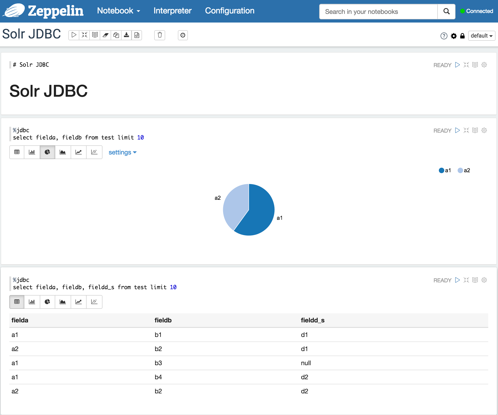

Solr JDBC - Apache Zeppelin
===========================
:page-shortname: solr-jdbc-apache-zeppelin
:page-permalink: solr-jdbc-apache-zeppelin.html

Note:

This requires Apache Zeppelin 0.6.0 or greater which contains the JDBC interpreter.

For http://zeppelin.apache.org[Apache Zeppelin], you will need to create a JDBC interpreter for Solr. This will add SolrJ to the interpreter classpath. Once the interpreter has been created, you can create a notebook to issue queries.

[[SolrJDBC-ApacheZeppelin-CreatetheApacheSolrJDBCInterpreter]]
== Create the Apache Solr JDBC Interpreter

 image::images/solr-jdbc-apache-zeppelin/zeppelin_solrjdbc_2.png[image,height=400]
 image::images/solr-jdbc-apache-zeppelin/zeppelin_solrjdbc_3.png[image,height=400]

[[SolrJDBC-ApacheZeppelin-CreateaNotebook]]
== Create a Notebook

 image::images/solr-jdbc-apache-zeppelin/zeppelin_solrjdbc_5.png[image,width=839,height=400]

[[SolrJDBC-ApacheZeppelin-QuerywiththeNotebook]]
== Query with the Notebook

