= Solr JDBC - SQuirreL SQL
:page-shortname: solr-jdbc-squirrel-sql
:page-permalink: solr-jdbc-squirrel-sql.html

For http://squirrel-sql.sourceforge.net[SQuirreL SQL], you will need to create a new driver for Solr. This will add several SolrJ client .jars to the SQuirreL SQL classpath. The files required are:

* all .jars found in `$SOLR_HOME/dist/solrj-libs`
* the SolrJ .jar found at `$SOLR_HOME/dist/solr-solrj-<version>.jar`

Once the driver has been created, you can create a connection to Solr with the connection string format outlined in the generic section and use the editor to issue queries.

[[SolrJDBC-SQuirreLSQL-AddSolrJDBCDriver]]
== Add Solr JDBC Driver

[[SolrJDBC-SQuirreLSQL-OpenDrivers]]
=== Open Drivers

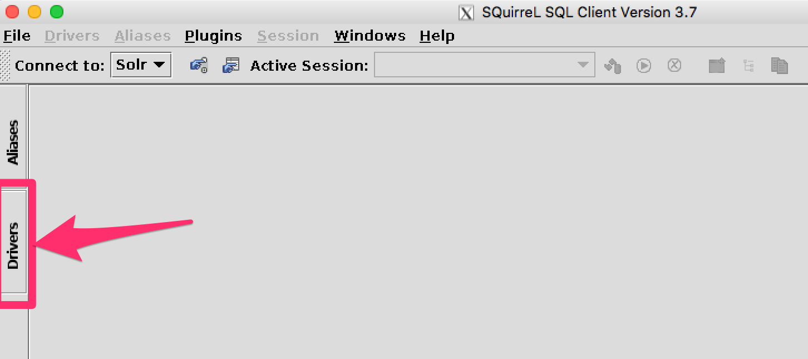


[[SolrJDBC-SQuirreLSQL-AddDriver]]
=== Add Driver

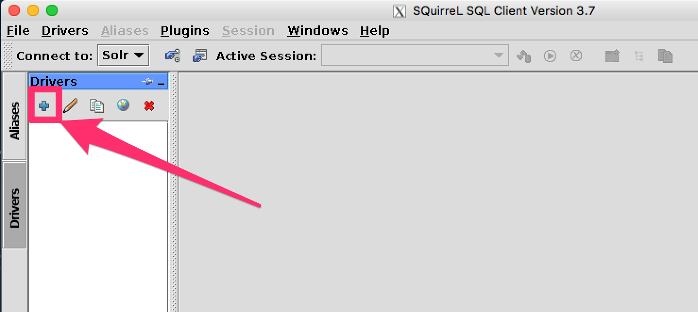


[[SolrJDBC-SQuirreLSQL-NametheDriver]]
=== Name the Driver

Provide a name for the driver, and provide the URL format: `jdbc:solr://<zk_connection_string>/?collection=<collection>`. Do not fill in values for the variables "```zk_connection_string```" and "```collection```", those will be defined later when the connection to Solr is configured.

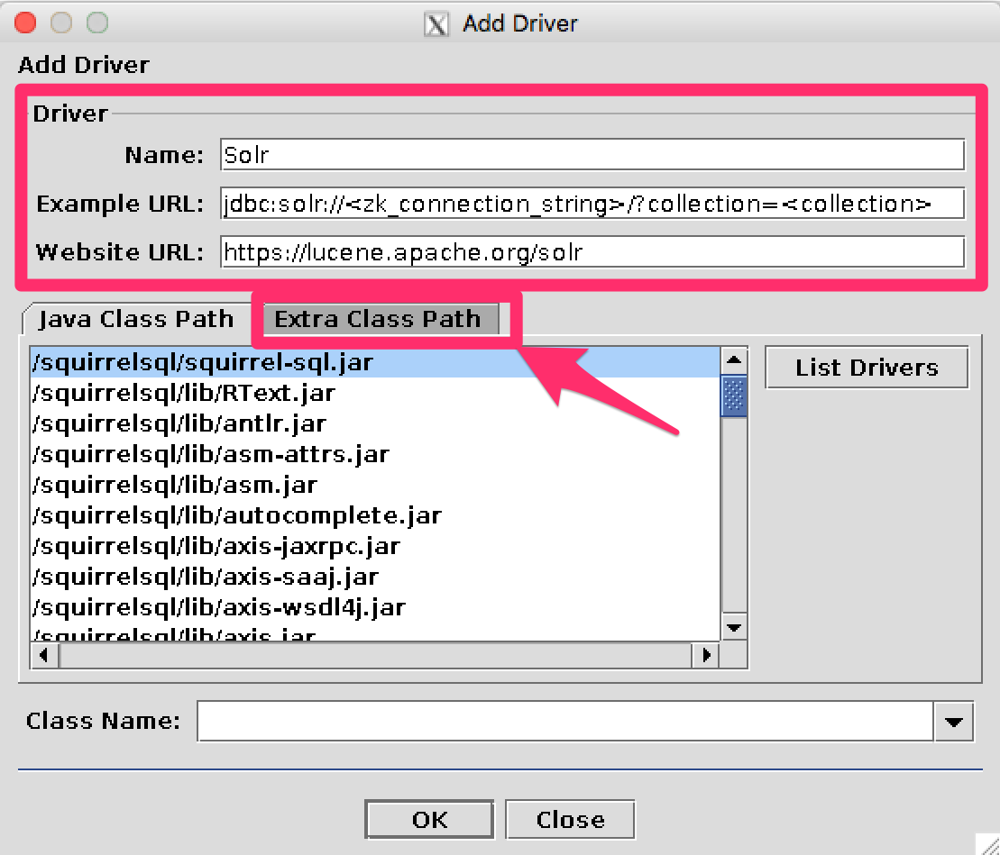


[[SolrJDBC-SQuirreLSQL-AddSolrJDBCjarstoClasspath]]
=== Add Solr JDBC jars to Classpath

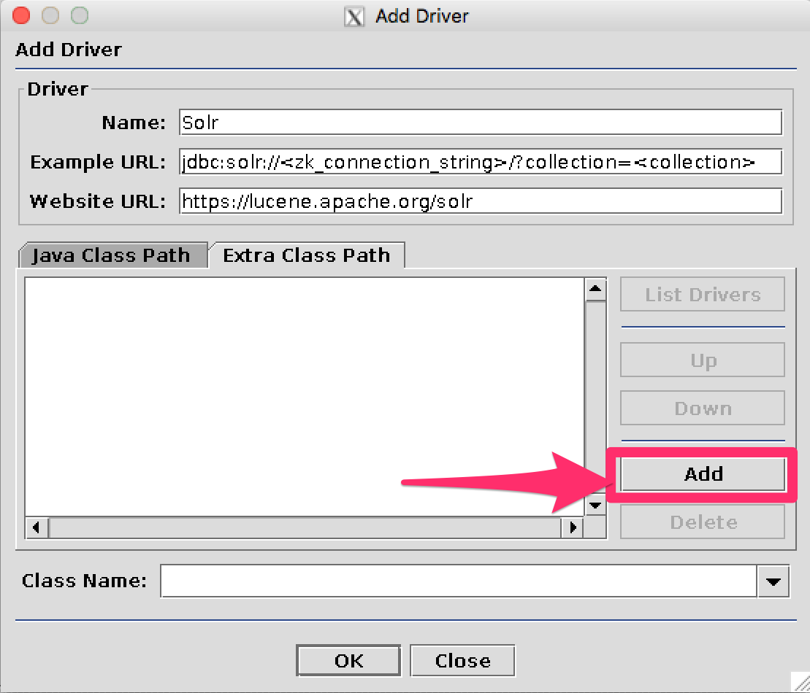


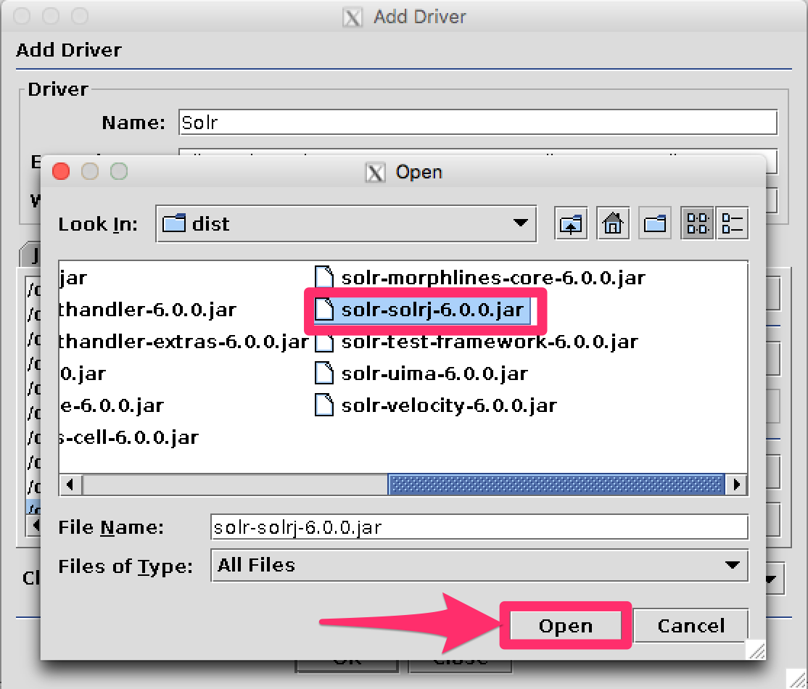


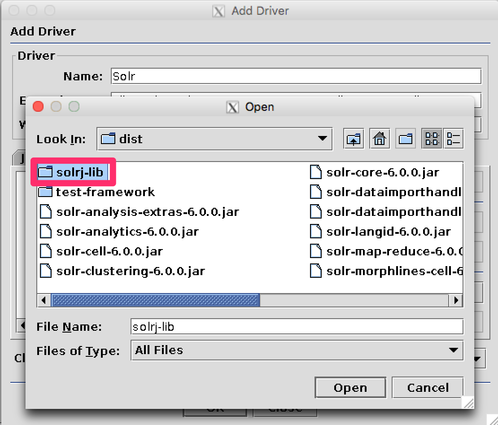


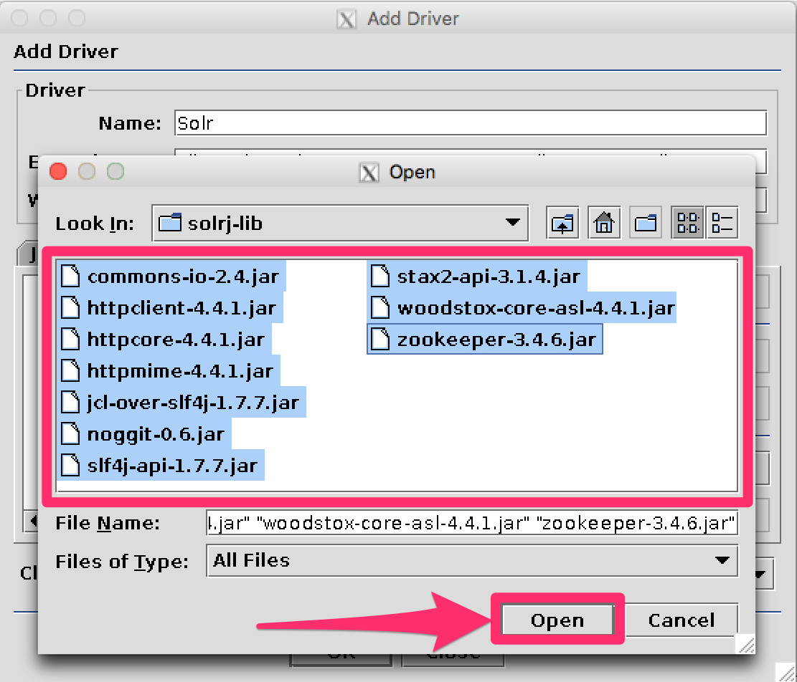


[[SolrJDBC-SQuirreLSQL-AddtheSolrJDBCdriverclassname]]
=== Add the Solr JDBC driver class name

After adding the .jars, you will need to additionally define the Class Name `org.apache.solr.client.solrj.io.sql.DriverImpl`.

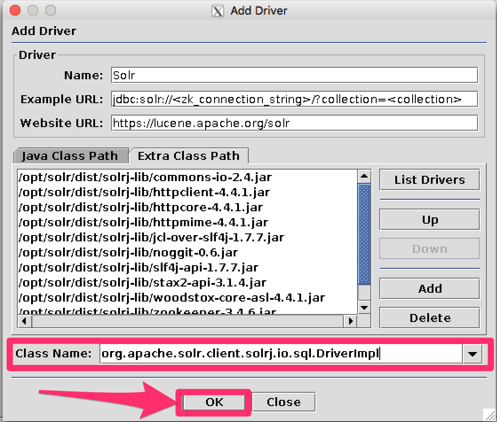


[[SolrJDBC-SQuirreLSQL-CreateanAlias]]
== Create an Alias

To define a JDBC connection, you must define an alias.

[[SolrJDBC-SQuirreLSQL-OpenAliases]]
=== Open Aliases

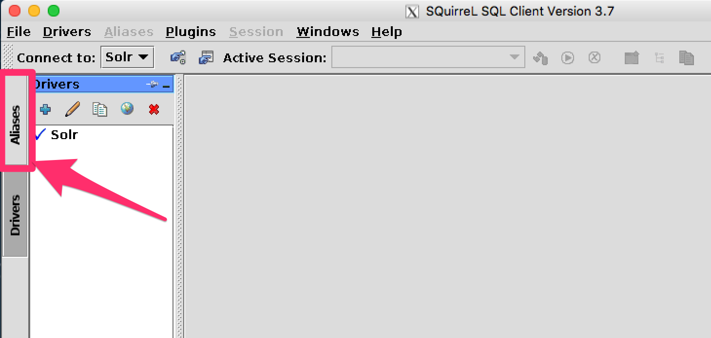


[[SolrJDBC-SQuirreLSQL-AddanAlias]]
=== Add an Alias

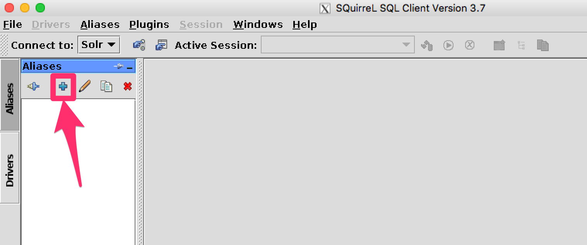


[[SolrJDBC-SQuirreLSQL-ConfiguretheAlias]]
=== Configure the Alias

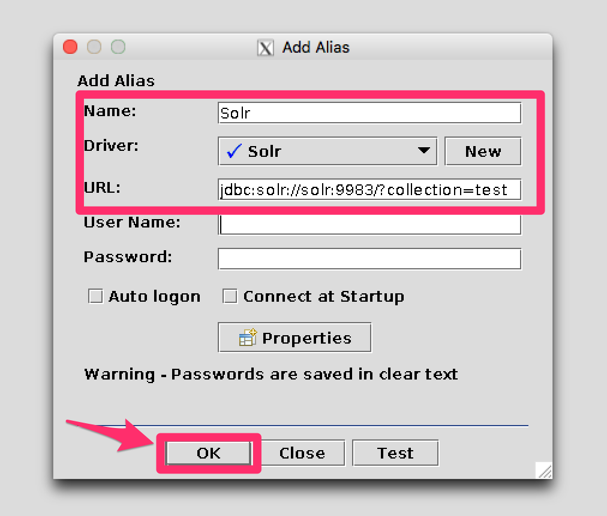


[[SolrJDBC-SQuirreLSQL-ConnecttotheAlias]]
=== Connect to the Alias

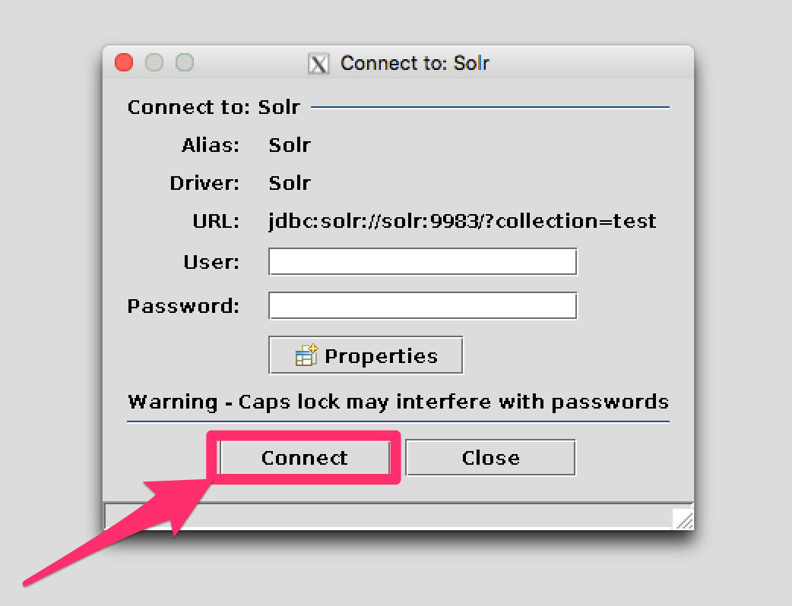


[[SolrJDBC-SQuirreLSQL-Querying]]
== Querying

Once you've successfully connected to Solr, you can use the SQL interface to enter queries and work with data.

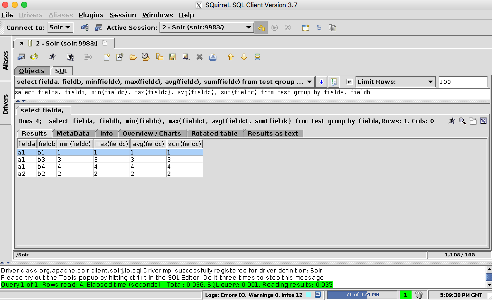

