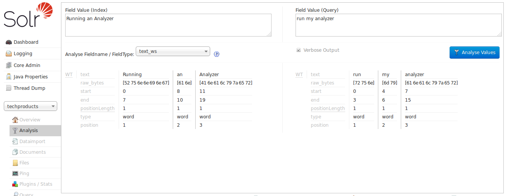
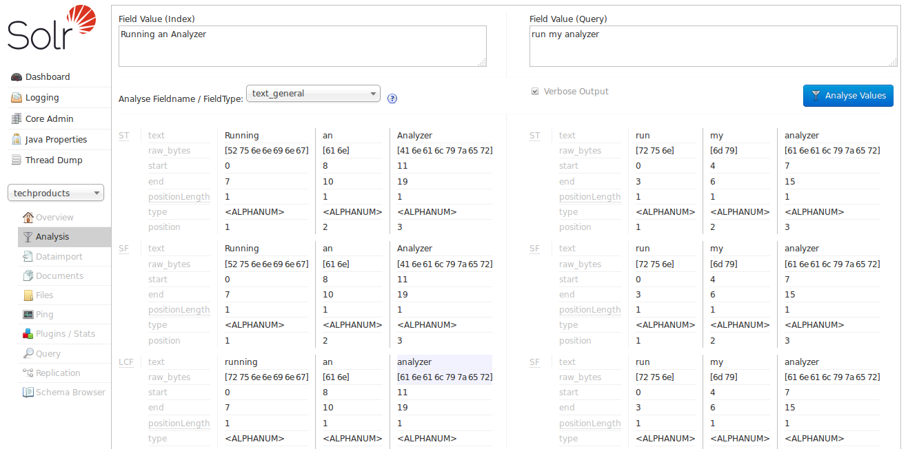
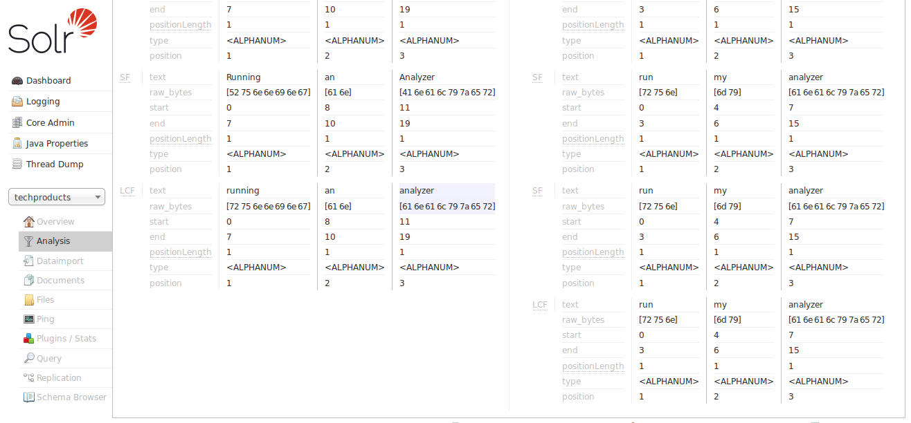

= Running Your Analyzer
:page-description: Testing and running analysis.
:page-permalink: Running-Your-Analyzer.html
:page-shortname: running-your-analyzer

Once you've defined a field type in `schema.xml` and specified the analysis steps that you want applied to it, you should test it out to make sure that it behaves the way you expect it to. Luckily, there is a very handy page in the Solr <<Using-the-Solr-Administration-User-Interface.adoc,admin interface>> that lets you do just that. You can invoke the analyzer for any text field, provide sample input, and display the resulting token stream.

For example, let's look at some of the "Text" field types available in the "`bin/solr -e techproducts`" example configuration, and use the <<Analysis-Screen.adoc,Analysis Screen>> (http://localhost:8983/solr/#/techproducts/analysis) to compare how the tokens produced at index time for the sentence "`Running an Analyzer`" match up with a slightly different query text of "`run my analyzers`".

We can begin with "`text_ws`" - one of the most simplified Text field types available:  We can see very clearly that the only thing this field type does is tokenize text on whitespace. If our objective is to allow queries like "`run my analyzer`" to match indexed text like "`Running an Analyzer`" then we will evidently need to pick a different field type with index & query time text analysis that does more processing of the inputs.

In particular we will want:

* Case insensitivity, so "Analyzer" and "analyzer" match.
* Stemming, so words like "Run" and "Running" are considered equivalent terms.
* Stop Word Pruning, so small words like "an" and "my" don't affect the query.

For our next attempt, let's try the "`text_general`" field type:  With the verbose output enabled, we can see how each stage of our new analyzers modify the tokens they receive before passing them on to the next stage. As we scroll down to the final output, we can see that we do start to get a match on "analyzer" from each input string, thanks to the "LCF" stage -- which if you hover over with your mouse, you'll see is the "`LowerCaseFilter`":

 "`text_general`" is designed to be generally useful for any language, and it has definitely gotten us closer to our objective then "`text_ws`" by solving the problem of case sensitivity, by but it's still not quite what we are looking for. So now let us try the "`text_en`" field type:

Now we can see the "SF" (`StopFilter`) stage of the analyzers solving the problem of removing Stop Words, and as we scroll down, we also see the "PSF" (`PorterStemFilter`) stage apply stemming rules suitable for our English language input, such that the terms produced by our "index analyzer" and the terms produced by our "query analyzer" match the way we expect.

At this point, we can continue to experiment with additional inputs, verifying that our analyzers produce matching tokens when we expect them to match, and disparate tokens when we do not expect them to match, as we iterate and tweak our field type configuration.
