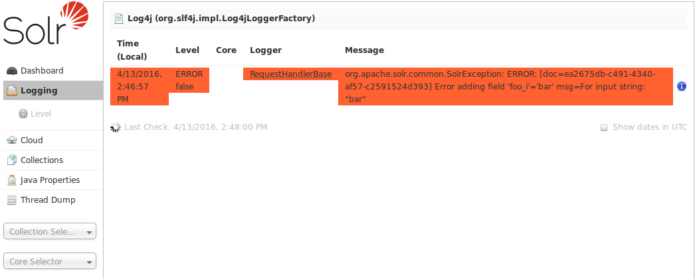
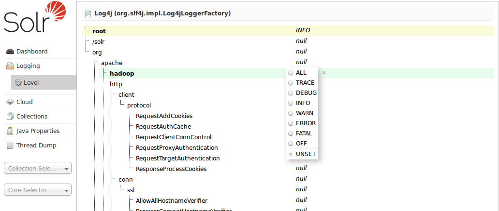

= Configuring Logging
:page-shortname: configuring-logging
:page-permalink: configuring-logging.html

[IMPORTANT]
====

In addition to the logging options described below, there is a way to configure which request parameters (such as parameters sent as part of queries) are logged with an additional request parameter called `logParamsList`. See the section on <<common-query-parameters.adoc#CommonQueryParameters-ThelogParamsListParameter,Common Query Parameters>> for more information.

====

[[ConfiguringLogging-TemporaryLoggingSettings]]
== Temporary Logging Settings

You can control the amount of logging output in Solr by using the Admin Web interface. Select the *LOGGING* link. Note that this page only lets you change settings in the running system and is not saved for the next run. (For more information about the Admin Web interface, see <<using-the-solr-administration-user-interface.adoc#,Using the Solr Administration User Interface>>.)

 +
_The Logging screen._

This part of the Admin Web interface allows you to set the logging level for many different log categories. Fortunately, any categories that are *unset* will have the logging level of its parent. This makes it possible to change many categories at once by adjusting the logging level of their parent.

When you select **Level**, you see the following menu:

 +
_The Log Level Menu._

Directories are shown with their current logging levels. The Log Level Menu floats over these. To set a log level for a particular directory, select it and click the appropriate log level button.

Log levels settings are as follows:

[width="100%",cols="50%,50%",options="header",]
|===
|Level |Result
|FINEST |Reports everything.
|FINE |Reports everything but the least important messages.
|CONFIG |Reports configuration errors.
|INFO |Reports everything but normal status.
|WARN |Reports all warnings.
|SEVERE |Reports only the most severe warnings.
|OFF |Turns off logging.
|UNSET |Removes the previous log setting.
|===

Multiple settings at one time are allowed.

[[ConfiguringLogging-PermanentLoggingSettings]]
== Permanent Logging Settings

Solr uses http://logging.apache.org/log4j/1.2/[Log4J version 1.2] for logging and is configured using `server/resources/log4j.properties`. Take a moment to inspect the contents of the `log4j.properties` file so that you are familiar with its structure. By default, Solr log messages will be written to `server/logs/solr.log` and to stdout (console), which is fine when you're just getting started with Solr.

When you're ready to deploy Solr in production, we recommend making a few minor changes to the log settings. Edit `log4j.properties` and set the `solr.log` property to the location where you want Solr to write log files, such as `/var/solr/logs`. Note that if you installed Solr as a service using the instructions provided at <<taking-solr-to-production.adoc#,Taking Solr to Production>>, then see `/var/solr/log4j.properties` instead of the default `server/resources` version.

[source,plain]
----
solr.log=/var/solr/logs
----

Alternatively, you can use the `solr.solr.home` system property to set the location of the log files, such as:

[source,plain]
----
solr.log=${solr.solr.home}/../logs
----

During initialization, Log4J will resolve this to a path based on the `solr.solr.home` system property. While you’re customizing the `log4j.properties` file, we also recommend removing the CONSOLE appender from the rootLogger by changing the `log4j.rootLogger` property to:

[source,plain]
----
log4j.rootLogger=INFO, file
----

Also, the default log rotation size threshold of 4MB is too small for production servers and should be increased to a larger value (such as 100MB or more).

[source,plain]
----
log4j.appender.file.MaxFileSize=100MB
----

[[ConfiguringLogging-LoggingSlowQueries]]
== Logging Slow Queries

For high-volume search applications, logging every query can generate a large amount of logs and, depending on the volume, potentially impact performance. If you mine these logs for additional insights into your application, then logging every query request may be useful. On the other hand, if you're only concerned about warnings and error messages related to requests, then you can set the log verbosity to WARN. However, this poses a potential problem in that you won't know if any queries are slow, as slow queries are still logged at the INFO level. Solr provides a way to set your log verbosity threshold to WARN and be able to set a latency threshold above which a request is considered "slow" and log that request at the WARN level to help you identify slow queries in your application. To enable this behavior, configure the `<slowQueryThresholdMillis>` element in the *query* section of solrconfig.xml:

[source,plain]
----
<slowQueryThresholdMillis>1000</slowQueryThresholdMillis>
----

Any queries that take longer than the specified threshold will be logged as "slow" queries at the WARN level.
