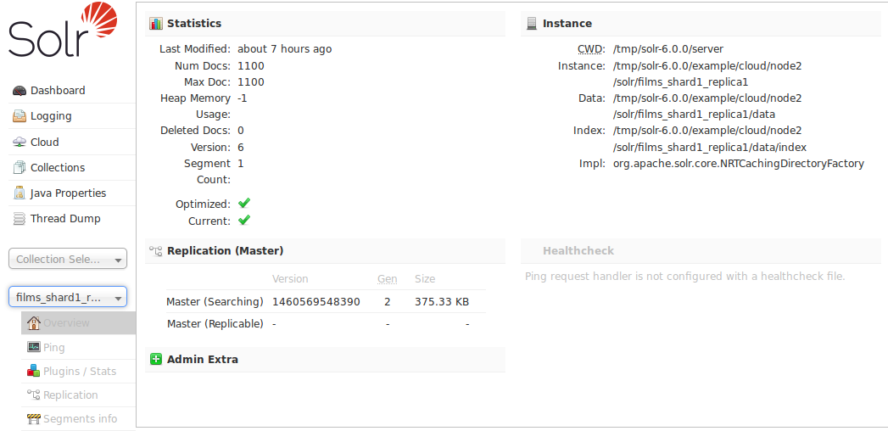

= Core-Specific Tools
:page-shortname: core-specific-tools
:page-permalink: core-specific-tools.html
:page-children: ping, plugins-stats-screen, replication-screen, segments-info

In the left-hand navigation bar, you will see a pull-down menu titled "Core Selector". Clicking on the menu will show a list of Solr cores hosted on this Solr node, with a search box that can be used to find a specific core by name. When you select a core from the pull-down, the main display of the page will display some basic metadata about the core, and a secondary menu will appear in the left nav with links to additional core specific administration screens. You can also define a configuration file called `admin-extra.html` that includes links or other information you would like to display in the "Admin Extra" part of this main screen.

The core-specific UI screens are listed below, with a link to the section of this guide to find out more:

* <<ping.adoc#ping,Ping>> - lets you ping a named core and determine whether the core is active.
* <<plugins-stats-screen.adoc#plugins-stats-screen,Plugins/Stats>> - shows statistics for plugins and other installed components.
* <<replication-screen.adoc#replication-screen,Replication>> - shows you the current replication status for the core, and lets you enable/disable replication.
* <<segments-info.adoc#segments-info,Segments Info>> - Provides a visualization of the underlying Lucene index segments.

If you are running a single node instance of Solr, additional UI screens normally displayed on a per-collection bases will also be listed:

* https://cwiki.apache.org/confluence/display/solr/Analysis+Screen[Analysis] - lets you analyze the data found in specific fields.
* https://cwiki.apache.org/confluence/display/solr/Dataimport+Screen[Dataimport] - shows you information about the current status of the Data Import Handler.
* https://cwiki.apache.org/confluence/display/solr/Documents+Screen[Documents] - provides a simple form allowing you to execute various Solr indexing commands directly from the browser.
* https://cwiki.apache.org/confluence/display/solr/Files+Screen[Files] - shows the current core configuration files such as `solrconfig.xml`.
* https://cwiki.apache.org/confluence/display/solr/Query+Screen[Query] - lets you submit a structured query about various elements of a core.
* https://cwiki.apache.org/confluence/display/solr/Stream+Screen[Stream] - allows you to submit streaming expressions and see results and parsing explanations.
* https://cwiki.apache.org/confluence/display/solr/Schema+Browser+Screen[Schema Browser] - displays schema data in a browser window.
