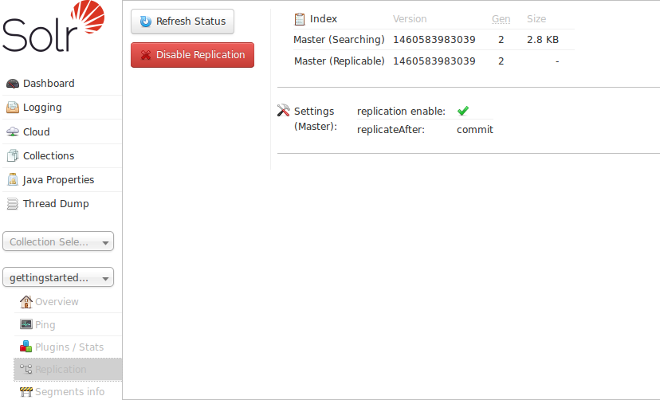

= Replication Screen
:page-shortname: replication-screen
:page-permalink: replication-screen.html

The Replication screen shows you the current replication state for the core you have specified. <<solrcloud.adoc#solrcloud,SolrCloud>> has supplanted much of this functionality, but if you are still using Master-Slave index replication, you can use this screen to:

1.  View the replicatable index state. (on a master node)
2.  View the current replication status (on a slave node)
3.  Disable replication. (on a master node)

.Caution When Using SolrCloud
[IMPORTANT]
====

When using <<getting-started-with-solrcloud.adoc#getting-started-with-solrcloud,SolrCloud>>, do not attempt to disable replication via this screen.

====

More details on how to configure replication is available in the section called <<index-replication.adoc#index-replication,Index Replication>>.
